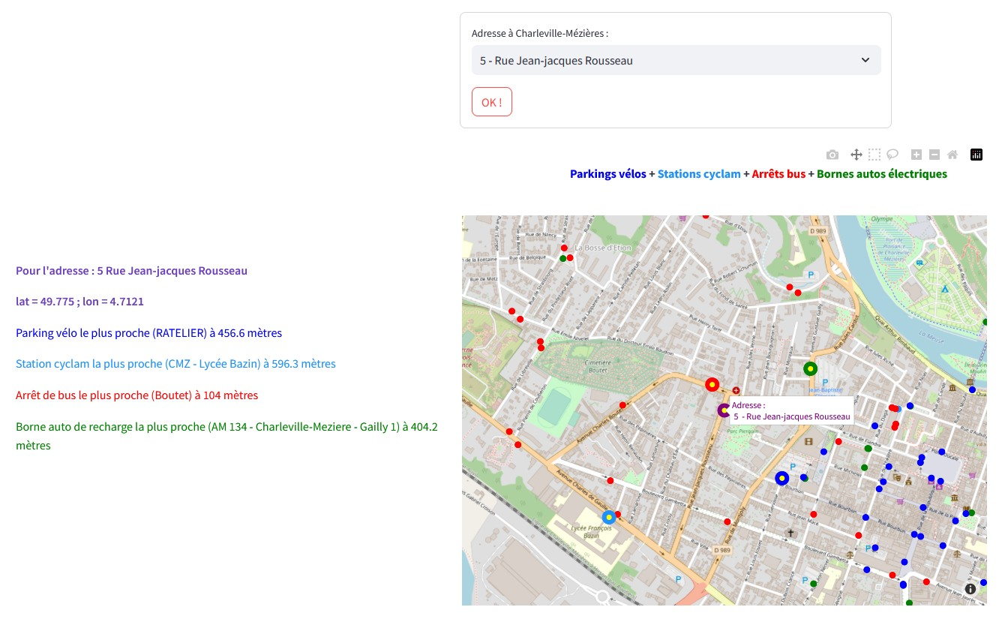

[Carte interactive de Charleville-Mézières](https://ardennes-mobilite.streamlit.app/) répertoriant d'une part :

 - ${\color{blue}les\space parkings\space à\space vélo}$
 - ${\color{dodgerblue}les\space stations\space Cyclam}$
 - ${\color{red}les\space arrêts\space de\space bus}$
 - ${\color{green}les\space bornes\space de\space recharges\space électriques\space pour\space les\space automobiles}$

et d'autre part :

 - La consommation énergétique dans le département des Ardennes
 - Le marché immobilier à Charleville-Mézières 

Source de données :
 - [OpenStreetMap](https://www.openstreetmap.org/) (via [Geodatamine](https://geodatamine.fr/)  et [Overpass-turbo](https://overpass-turbo.eu/) )  
 - [Data Gouv](https://www.data.gouv.fr/fr/pages/donnees-energie/)  
 - [INSEE](https://www.insee.fr/fr/statistiques/6683037)
 - [Cyclam](https://cyclam.ecovelo.mobi/#/home)

Lien vers l'appli : [Appli-Mobilité](https://ardennes-mobilite.streamlit.app/)  

 <a href="https://ardennes-mobilite.streamlit.app/" target="_blank">
<a href="https://ardennes-mobilite.streamlit.app/" target="_blank">
 

